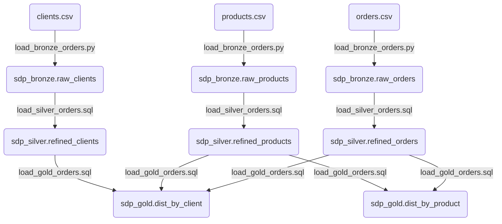

In this article, you will find information about the [Spark Declarative Pipelines (SDP)](https://spark.apache.org/docs/latest/declarative-pipelines-programming-guide.html) feature in [Spark v4.1](https://spark.apache.org/releases/spark-release-4.1.0.html).

<!--more-->

# Introduction 

In June 2022, [Databricks](https://www.databricks.com/) announced the general availability of a new feature named [Delta Live Tables (DLT)](https://www.databricks.com/blog/2022/04/05/announcing-generally-availability-of-databricks-delta-live-tables-dlt.html) within its ecosystem, enabling the declarative development of Spark processing pipelines.
This feature was primarily based on the [Delta Lake](https://docs.databricks.com/aws/en/delta/) data format and the [Unity Catalog](https://www.databricks.com/product/unity-catalog) data catalog.

In June 2025, during the [Data+AI Summit 2025](https://www.databricks.com/dataaisummit) event, [Databricks](https://www.databricks.com/) publicly announced [the open-sourcing of a core part of its declarative data processing framework based on Apache Spark](https://www.databricks.com/company/newsroom/press-releases/databricks-donates-declarative-pipelines-apache-sparktm-open-source). Consequently, it excluded a large number of features and optimizations that will remain exclusively available on the Databricks platform.

In July 2025, [Databricks](https://www.databricks.com/) announced the renaming of the Delta Live Tables feature to [Lakeflow Declarative Pipelines](https://www.databricks.com/blog/whats-new-lakeflow-declarative-pipelines-july-2025), which became the official name of this feature within the Databricks platform.


# Information

[Spark Declarative Pipelines (SDP)](https://spark.apache.org/docs/latest/declarative-pipelines-programming-guide.html) is a new component of Apache Spark 4.1 designed to allow developers to focus on data transformations rather than the explicit management of dependencies and pipeline execution.
In practice, SDP framework allows you to describe what the data should look like, and Spark handles the "how": task scheduling, parallelism, checkpoints, and retries.

The API relies on Python decorators and SQL, with a dedicated client (`spark-pipelines`) to execute the pipelines.

SDP framework manages execution order, dependency resolution, and incremental processing, which simplifies pipeline development, maintenance, testing, and monitoring.

The framework is similar to tools like [DBT](https://www.getdbt.com/) or [SQLMesh](https://sqlmesh.readthedocs.io/en/stable/), but it is still immature and has a very limited ecosystem (features, documentation, optimizations, possibilities, compatibilities, etc.).


[The official programming guide](https://spark.apache.org/docs/4.1.1/declarative-pipelines-programming-guide.html#querying-tables-defined-in-your-pipeline) is extremely clear and concise for understanding the key concepts.

Key elements :
- The pipeline definition YAML file defines the structural elements for parsing and executing flows.
- You can use Python scripts (with decorators) and SQL scripts.
- Three types of usable `datasets` :
    - **Streaming Table** : Used to create a table to store data processed with Spark Streaming.
        - Python syntax : `@dp.table` or `dp.create_streaming_table`
        - SQL syntax : `CREATE STREAMING TABLE`
    - **Materialized View** : Used to create a table to store batch data.
        - Python syntax : `@dp.materialized_view`
        - SQL syntax : `CREATE MATERIALIZED VIEW`
    - **Temporary View** : Used to create a temporary view for intermediate results during pipeline execution.
        - Python syntax : `@dp.temporary_view`
        - SQL syntax : `CREATE TEMPORARY VIEW`


Specific SDP framework commands :
- `spark-pipelines init` : To initialize a new project.
- `spark-pipelines dry-run --spec pipeline_def.yaml` : To validate a pipeline without executing it (very useful for validating developments with CI/CD pipelines).
- `spark-pipelines run --spec pipeline_def.yaml` : To execute the desired pipeline.


General operation of the SDP framework :
1. Execution start.
2. Reading of the pipeline definition file.
3. Creation of a Spark session based on the configuration elements defined in the pipeline definition file.
4. Parsing of all Python or SQL files listed in the pipeline definition file.
5. Generation of the `dataflow graph`, allowing the engine to plan the execution order of the various pipeline elements based on declared dependencies.
6. Execution of the various flows in the defined order (parallelization and sequencing based on dependencies).
7. Execution end.


Documentation :
- [PySpark decorator](https://spark.apache.org/docs/4.1.1/declarative-pipelines-programming-guide.html#programming-with-sdp-in-python) : [Python API](https://spark.apache.org/docs/latest/api/python/reference/pyspark.pipelines.html)
- [SQL syntax](https://spark.apache.org/docs/4.1.1/declarative-pipelines-programming-guide.html#programming-with-sdp-in-sql)  

> **Warning** : 
> During testing, the framework struggled to define the dependency graph when the code was written entirely using Python decorators. Many errors were related to the framework searching for the existence of a table in the data catalog rather than within the pipeline scripts. The use of SQL code seems much better handled for the time being.


# Advantages

1. **Automatic dependency resolution and pipeline execution optimization** : This is the most tangible benefit. The order in which Python functions or SQL queries are defined does not matter. The SDP famework analyzes the graph and determines the optimal execution order. The SDP framework runs queries without direct dependencies in parallel, then sequentially executes those with dependencies.
2. **Enables pre-execution validation with dry-run** : The `dry-run` feature detects syntax errors (Python or SQL), analysis errors (missing tables or columns), and graph validation errors like cyclic dependencies without reading or writing any data. This allows for automated checks within CI/CD pipelines.
3. **Format-agnostic** : The SDP framework supports all data sources and catalogs supported by Spark. It is recommended to use [Iceberg](https://iceberg.apache.org) or [Delta Lake](https://docs.databricks.com/aws/en/delta/) data formats.
4. **Easier maintenance** : Understanding and maintaining a pipeline based on a declarative framework is much easier than managing a set of imperative PySpark processes.


# Limitations

1. **Ecosystem immaturity (features and tooling)** : The SDP framework is in a very active development cycle. The behavior of certain features may change between Spark versions. Not everything is documented yet. It is far too early for production adoption. Popular orchestrators ([Apache Airflow](https://airflow.apache.org/), [Prefect](https://www.prefect.io/), [Dagster](https://dagster.io/)) do not necessarily support this framework (or do so in a very limited way).
2. **Premium features remain exclusive to Databricks** : Features not available in the open-source SDP framework include, for example:
    1. `Auto CDC` (Change Data Capture)
    2. `Expectations` with automatic `enforcement` (`@dp.expect`, automated quarantine of invalid rows)
    3. Visual data lineage and integrated advanced observability
    4. Queryable event logs for pipeline auditing
3. **Less intuitive debugging compared to imperative code** : Stack traces reference internal SDP framework classes rather than the specific lines of Python or SQL code. This is particularly critical for teams used to debugging Spark jobs using commands like `spark.read` or `df.show()`.
4. **Function and optimization limitations** : There are far fewer options for handling complex pipelines and processing; this may require reverting to imperative code (e.g., state management for streaming, need for unsupported functions like `pivot`, ...).


# Codes

## Approach

To test the SDP framework, we will follow these steps :
1. Local Spark v4.1.1 cluster creation
2. Creation of a limited dataset
3. Creation of a pipeline within an SDP framework project
4. Execution of the created pipeline


The folders used for this project are :
- `application` : Folder for storing all scripts 
- `data` : Folder for storing datasets (input and output)
- `logs` : Folder for storing Spark cluster execution logs
- `spark-image-docker` : Folder for storing the files required to create the Docker image


## Cluster Spark

To test this SDP framework with Spark version 4.1.1, we will create a Docker image and the necessary components to set up a local cluster consisting of one Master node (driver) and two Worker nodes.


### Creating a Docker Image

Steps to perform from the **spark-image-docker** directory :
1. Create the `spark-defaults.conf` file to define the Spark cluster configuration elements.
2. Create the `spark-env.sh` file to define the environment variables for the Spark cluster.
3. Create the `spark-start.sh` file to define the execution script for the Spark cluster services.
4. Create the `Dockerfile` to define the Spark image content for cluster creation.
5. Execute the Docker image creation command : `docker build -t spark4 spark-image-docker --no-cache`


Content of the **spark-defaults.conf** file :
```bash
# --- Force JARs into Classpath ---
spark.driver.extraClassPath      /opt/spark/jars/*
spark.executor.extraClassPath    /opt/spark/jars/*

# --- History Server Configuration ---
spark.eventLog.enabled              true
spark.eventLog.dir                  file:///opt/spark/event_logs
spark.history.fs.logDirectory       file:///opt/spark/event_logs

# --- Delta Configuration ---
spark.connect.extensions.relation.classes   org.apache.spark.sql.connect.delta.DeltaRelationPlugin
spark.connect.extensions.command.classes    org.apache.spark.sql.connect.delta.DeltaCommandPlugin
spark.sql.extensions                        io.delta.sql.DeltaSparkSessionExtension

# --- Database Configurations ---
spark.sql.catalog.spark_catalog             org.apache.spark.sql.delta.catalog.DeltaCatalog


# --- Default Catalog configuration ---
spark.sql.defaultCatalog                spark_catalog

# --- Default warehouse local path configuration ---
spark.sql.warehouse.dir              file:///opt/spark/data/warehouse
```

Content of the **spark-env.sh** file :
```bash
#!/bin/env bash

export SPARK_LOCAL_IP=`hostname -i`
export SPARK_PUBLIC_DNS=`hostname -f`
```


Content of the **spark-start.sh** file :
```bash
#!/bin/bash

# Start the SSH daemon
/usr/sbin/sshd
if [ $? -ne 0 ]; then
    echo "Failed to start SSH server. Exiting."
    exit 1
fi

if [ "$SPARK_MODE" = "master" ]; then
    echo "Starting Spark Master..."
    # Spark Master/Driver
    $SPARK_HOME/sbin/start-master.sh 
    # Spark Connect
    $SPARK_HOME/sbin/start-connect-server.sh 
    # History server
    $SPARK_HOME/sbin/start-history-server.sh 
elif [ "$SPARK_MODE" = "worker" ]; then
    echo "Starting Spark Worker..."
    # Spark Worker
    $SPARK_HOME/sbin/start-worker.sh $SPARK_MASTER_URL
else
    echo "Unknown SPARK_MODE: $SPARK_MODE"
    exit 1
fi

# Keep the container alive
tail -f $SPARK_HOME/logs/*
```


Content of the **Dockerfile** file :
```docker
# Use OpenJDK base image
FROM eclipse-temurin:21-jdk-jammy


# Define env variables
ENV SPARK_MASTER="spark://spark-master:7077"
ENV SPARK_MASTER_HOST=spark-master
ENV SPARK_MASTER_PORT=7077
ENV PYSPARK_PYTHON=python3
ENV SPARK_HOME=/opt/spark
ENV PATH=$PATH:$SPARK_HOME/bin:$SPARK_HOME/sbin
ENV DELTA_VERSION="4.1.0"
ENV SPARK_VERSION="4.1.1"
ENV SCALA_VERSION="2.13"


# Install tools
RUN apt-get update \
    && apt-get install -y --no-install-recommends wget tar iputils-ping rsync openssh-server openssh-client \
    && apt-get install -y --no-install-recommends python3 python3-pip \
    && rm -rf /var/lib/apt/lists/*

# Manage SSH informations
RUN mkdir -p /root/.ssh/ \
    && ssh-keygen -t rsa -f /root/.ssh/id_rsa -q -N "" \
    && cat /root/.ssh/id_rsa.pub >> /root/.ssh/authorized_keys \
    && chmod 600 /root/.ssh/authorized_keys \
    && echo "Host *" >> /root/.ssh/config \
    && echo "    StrictHostKeyChecking no" >> /root/.ssh/config \
    && chmod 600 /root/.ssh/config \
    && mkdir -p /var/run/sshd \
    && ssh-keygen -A

# Install Spark
RUN wget https://archive.apache.org/dist/spark/spark-${SPARK_VERSION}/spark-${SPARK_VERSION}-bin-hadoop3.tgz
RUN tar -xzf spark-${SPARK_VERSION}-bin-hadoop3.tgz \
    && rm spark-${SPARK_VERSION}-bin-hadoop3.tgz \
    && mv spark-${SPARK_VERSION}-bin-hadoop3 ${SPARK_HOME} \ 
    && chown -R root:root ${SPARK_HOME} \
    && mkdir -p ${SPARK_HOME}/logs \
    && mkdir -p ${SPARK_HOME}/event_logs

# Download the Delta Spark JAR directly into Spark's main jars directory
# Spark automatically loads all JARs from this folder on startup.
RUN wget https://repo1.maven.org/maven2/io/delta/delta-spark_${SCALA_VERSION}/${DELTA_VERSION}/delta-spark_${SCALA_VERSION}-${DELTA_VERSION}.jar -P ${SPARK_HOME}/jars/
RUN wget https://repo1.maven.org/maven2/io/delta/delta-storage/${DELTA_VERSION}/delta-storage-${DELTA_VERSION}.jar -P ${SPARK_HOME}/jars/
RUN wget https://repo1.maven.org/maven2/io/delta/delta-connect-client_${SCALA_VERSION}/${DELTA_VERSION}/delta-connect-client_${SCALA_VERSION}-${DELTA_VERSION}.jar -P ${SPARK_HOME}/jars/

# Set up Spark configuration for logging and history server
COPY spark-defaults.conf $SPARK_HOME/conf/spark-defaults.conf

# Set up Spark configuration scripts
COPY spark-env.sh $SPARK_HOME/conf/spark-env.sh
COPY spark-start.sh $SPARK_HOME/spark-start.sh
RUN chmod +x $SPARK_HOME/conf/spark-env.sh
RUN chmod +x $SPARK_HOME/spark-start.sh

# Expose needed ports
EXPOSE 7077 8080 4040 15002 22

# Entrypoint config
CMD ["/opt/spark/spark-start.sh"]

```


### Creating the Docker Compose file

Steps to perform from the root directory :
1. Create the `compose.yml` file to define the various cluster components, which will consist of one `Master` node and two `Worker` nodes.
2. Start the local cluster using the command `docker-compose up -d`
3. Stop the local cluster using the command `docker-compose down`

Content of the **compose.yml** file :
```yaml
services:

  spark-master:
    image: spark4
    container_name: spark-master
    hostname: spark-master
    environment:
      - SPARK_MODE=master
      - SPARK_RPC_AUTHENTICATION_ENABLED=false
      - SPARK_RPC_ENCRYPTION_ENABLED=false
      - SPARK_LOCAL_STORAGE_ENCRYPTION_ENABLED=false
      - SPARK_SSL_ENABLED=false
      - SPARK_PUBLIC_DNS=spark-master
      - SPARK_MASTER_HOST=spark-master
      - SPARK_MASTER_PORT=7077
      - SPARK_DRIVER_MEMORY=1g
      - SPARK_DRIVER_CORES=1
      - SPARK_EXECUTOR_MEMORY=1g
      - SPARK_MASTER_WEBUI_PORT=8080
    ports:
      - "4040:4040"   # Application UI (Job Details)
      - "8080:8080"   # Interface web du master
      - "7077:7077"   # Port de communication Spark
      - "15002:15002" # Port Spark Connect
      - "18080:18080" # Interface History Server
    deploy:
      resources:
        limits:
          cpus: '1'
          memory: 1G
    volumes:
      - ./data:/opt/spark/data
      - ./logs/events:/opt/spark/event_logs
      - ./application/src:/home/root/src
    networks:
      - spark-network


  spark-worker-1:
    image: spark4
    container_name: spark-worker-1
    hostname: spark-worker-1
    depends_on:
      - spark-master
    environment:
      - SPARK_MODE=worker
      - SPARK_MASTER_URL=spark://spark-master:7077
      - SPARK_RPC_AUTHENTICATE=false
      - SPARK_RPC_ENCRYPTION=false
      - SPARK_LOCAL_STORAGE_ENCRYPTION=false
      - SPARK_SSL_ENABLED=no
      - SPARK_PUBLIC_DNS=spark-worker-1
      - SPARK_MASTER_HOST=spark-master
      - SPARK_MASTER_PORT=7077
      - SPARK_WORKER_CORES=2
      - SPARK_WORKER_MEMORY=2g
      - SPARK_EXECUTOR_MEMORY=1g
      - SPARK_WORKER_WEBUI_PORT=8081
    ports:
      - "8081:8081" # Interface web (worker)
    volumes:
      - ./data:/opt/spark/data
    networks:
      - spark-network
    deploy:
      resources:
        limits:
          cpus: '2'
          memory: 2G


  spark-worker-2:
    image: spark4
    container_name: spark-worker-2
    hostname: spark-worker-2
    depends_on:
      - spark-master
    environment:
      - SPARK_MODE=worker
      - SPARK_MASTER_URL=spark://spark-master:7077
      - SPARK_RPC_AUTHENTICATE=false
      - SPARK_RPC_ENCRYPTION=false
      - SPARK_LOCAL_STORAGE_ENCRYPTION=false
      - SPARK_SSL_ENABLED=no
      - SPARK_PUBLIC_DNS=spark-worker-2
      - SPARK_MASTER_HOST=spark-master
      - SPARK_MASTER_PORT=7077
      - SPARK_WORKER_CORES=2
      - SPARK_WORKER_MEMORY=2g
      - SPARK_EXECUTOR_MEMORY=1g
      - SPARK_WORKER_WEBUI_PORT=8081
    ports:
      - "8082:8081" # Interface web (worker)
    volumes:
      - ./data:/opt/spark/data
    networks:
      - spark-network
    deploy:
      resources:
        limits:
          cpus: '2'
          memory: 2G


networks:
  spark-network:
    driver: bridge

```


Content of the log file after running the command `docker-compose up -d` :
```bash
[+] up 4/4
 ✔ Network spark4_spark-network Created
 ✔ Container spark-master       Created
 ✔ Container spark-worker-1     Created
 ✔ Container spark-worker-2     Created
```

Content of the log file after running the command `docker-compose down` :
```bash
[+] down 4/4
 ✔ Container spark-worker-2     Removed
 ✔ Container spark-worker-1     Removed
 ✔ Container spark-master       Removed
 ✔ Network spark4_spark-network Removed
```

### List of ports and interfaces

Based on the configuration in the **compose.yml** file:
- `4040` : Communication port for the [application UI (Jobs UI)](http://localhost:4040/jobs/)
- `7077` : Communication port for the Spark cluster (Internal)
- `8080` : Communication port for the [Master node web interface (driver)](http://localhost:8080/)
- `8081` : Communication port for [Worker #1 node web interface](http://localhost:8081/)
- `8082` : Communication port for [Worker #2 node web interface](http://localhost:8082/)
- `15002` : Communication port for the Spark Connect server
- `18080` : Communication port for the [History Server interface](http://localhost:18080/)

## Dataset

In the **data** directory:
1. Create an `input` directory: `mkdir -p data/input`
2. Create the `clients.csv` file to store a few rows defining customers
3. Create the `products.csv` file to store a few rows defining products
4. Create the `orders.csv` file to store a few rows defining product purchase events by customers


Content of the **clients.csv** file :
```text
id_client,lib_client,lib_city
1,Alice,Paris
2,Bob,Lyon
3,Charlie,Marseille
4,David,Lille
5,Eve,Bordeaux
```

Content of the **products.csv** file :
```text
id_product,lib_product,mnt_prix_unit,lib_category
101,Laptop,1200.0,Electronique
102,Souris,25.0,Accessoires
103,Clavier,45.0,Accessoires
104,Ecran,200.0,Electronique
105,Casque,80.0,Audio
```

Content of the **orders.csv** file :
```text
id_commande,id_client,id_product,nb_quantity,dt_commande
1,1,101,1,2025-10-01
2,2,102,2,2025-10-01
3,3,103,1,2025-10-02
4,1,104,1,2025-10-02
5,5,105,2,2025-10-03
6,2,101,1,2025-10-03
7,4,103,3,2025-10-04
8,1,102,1,2025-10-04
9,3,101,1,2025-10-05
10,5,104,1,2025-10-05
11,2,105,1,2025-10-06
12,4,101,1,2025-10-06
13,1,105,1,2025-10-07
14,3,102,4,2025-10-07
15,5,103,1,2025-10-08
```


## Creating a pipeline in an SDP project

The steps are as follows:
1. Install the SDP framework locally
2. Initialize an SDP template project using the `spark-pipelines init` command
3. Create the necessary components for the pipeline

### Installing the SDP framework locally

To install the components needed to test the SDP framework, use the following `pip` command: `pip install pyspark[pipelines]`.

Due to some dependency compatibility issues in my work environment, I used the following command to install the necessary components with the corresponding compatible versions: `pip install pyspark==4.1.1 pyspark[pipelines] protobuf==6.33.0`

### Initializing an SDP project

To initialize an SDP project, the easiest way is to navigate to the `application` directory and run the following command: `spark-pipelines init --name LoadOrdersData`.

This will create a directory named `LoadOrdersData` within the `application` directory, along with the following directory structure :
- `pipeline-storage/`: Directory for storing checkpoints when using Spark Streaming
- `transformations/`: Directory for storing all Python and SQL scripts defining the pipelines
- `spark-pipeline.yml`: Pipeline configuration file


### Creating the necessary components for the pipeline

The goal is to create the following pipeline :


Schema : 
[](/blog/web/20260427_spark_4_06_featture_SDP_01.png) 


The steps are as follows:
- Create the Python script `load_bronze_orders.py` to define the tables for storing data from the CSV files
- Create the SQL script `load_silver_orders.sql` to refine the tables from the bronze zone into the silver zone
- Create the SQL script `load_gold_orders.sql` to execute aggregation queries based on the tables from the silver zone


Content of the **load_bronze_orders.py** file :
```python
from pyspark import pipelines as dp
from pyspark.sql import DataFrame, SparkSession
from pyspark.sql.functions import current_timestamp


PATH_DATA_INPUT="file:///opt/spark/data/input"
spark = SparkSession.active()


# --- Bronze zone (raw loading) ---
@dp.materialized_view(name="sdp_bronze.raw_orders")
def raw_orders() -> DataFrame:
    return spark.read \
                .format("csv") \
                .option("header",True) \
                .option("inferSchema",True) \
                .load(f"{PATH_DATA_INPUT}/orders.csv") \
                .withColumn("ts_load_file", current_timestamp())

@dp.materialized_view(name="sdp_bronze.raw_clients")
def raw_clients() -> DataFrame:
    return spark.read \
                .format("csv") \
                .option("header",True) \
                .option("inferSchema",True) \
                .load(f"{PATH_DATA_INPUT}/clients.csv") \
                .withColumn("ts_load_file", current_timestamp())

@dp.materialized_view(name="sdp_bronze.raw_products")
def raw_products() -> DataFrame:
    return spark.read \
                .format("csv") \
                .option("header",True) \
                .option("inferSchema",True) \
                .load(f"{PATH_DATA_INPUT}/products.csv") \
                .withColumn("ts_load_file", current_timestamp())
```


Content of the **load_silver_orders.sql** file :
```sql
--- Silver Zone (cleaned & typed) ---
CREATE MATERIALIZED VIEW sdp_silver.refined_orders
AS
SELECT int(id_commande) 
    ,int(id_client) 
    ,int(id_product)
    ,int(nb_quantity)
    ,to_date(dt_commande) as dt_commande
    ,to_timestamp(ts_load_file) as ts_load_file
FROM sdp_bronze.raw_orders 
WHERE id_commande IS NOT NULL
;


CREATE MATERIALIZED VIEW sdp_silver.refined_clients
AS
SELECT int(id_client)
    ,string(lib_client) 
    ,string(lib_city)
    ,to_timestamp(ts_load_file) as ts_load_file
FROM sdp_bronze.raw_clients 
WHERE id_client IS NOT NULL
;


CREATE MATERIALIZED VIEW sdp_silver.refined_products
AS
SELECT int(id_product)
    ,string(lib_product)
    ,double(mnt_prix_unit)
    ,string(lib_category)
    ,to_timestamp(ts_load_file) as ts_load_file
FROM sdp_bronze.raw_products 
WHERE id_product IS NOT NULL
;
```

Content of the `load_gold_orders.sql` file :
```sql
--- Gold Zone (Business analyses) ---
CREATE MATERIALIZED VIEW sdp_gold.dist_by_client
AS
SELECT c.id_client, c.lib_client, ROUND(SUM(o.nb_quantity * p.mnt_prix_unit), 2) as total_expense
FROM sdp_silver.refined_orders o
INNER JOIN sdp_silver.refined_clients c 
ON (o.id_client = c.id_client)
INNER JOIN sdp_silver.refined_products p 
ON (o.id_product = p.id_product)
GROUP BY c.id_client, c.lib_client
ORDER BY total_expense DESC
;

CREATE MATERIALIZED VIEW sdp_gold.dist_by_product
AS 
SELECT p.id_product, p.lib_product, SUM(o.nb_quantity) as sales_volume
FROM sdp_silver.refined_orders o
INNER JOIN sdp_silver.refined_products p 
ON (o.id_product = p.id_product)
GROUP BY p.id_product, p.lib_product
ORDER BY sales_volume DESC
;
```


### Creating elements to manage the environment

To properly manage the environment, we will create two PySpark scripts in the `application/LoadOrdersData` directory:
- The `init_schemas.py` script will create the schemas needed to create the pipeline tables
    - `sdp_bronze`: For storing bronze tables
    - `sdp_silver`: For storing silver tables
    - `sdp_gold`: For storing gold tables
- The `check_list_tables.py` script will displays all the created elements


Content of the **init_schemas.py** file :
```python
from pyspark.sql import SparkSession
from pyspark.sql.functions import col

REMOTE_URL = "sc://localhost:15002"

spark = SparkSession.builder.remote(REMOTE_URL).getOrCreate()

spark.sql("CREATE SCHEMA IF NOT EXISTS sdp_bronze COMMENT 'Schema for SDP Pipelines - Bronze Zone'")
spark.sql("CREATE SCHEMA IF NOT EXISTS sdp_silver COMMENT 'Schema for SDP Pipelines - Silver Zone'")
spark.sql("CREATE SCHEMA IF NOT EXISTS sdp_gold COMMENT 'Schema for SDP Pipelines - Gold Zone'")

list_schemas = spark.sql("show schemas;").where(col("namespace").like('sdp_%'))

nb_sdp_schema = list_schemas.count()

if (nb_sdp_schema == 3):
    print(f"[INFO] The SDP Schemas have been successfully created !")
else :
    print(f"[WARN] The SDP Schemas were not created successfully !")

list_schemas.show()

spark.stop()
```

Content of the **check_list_tables.py** file :
```python
from pyspark.sql import SparkSession
from pyspark.sql.functions import col

REMOTE_URL = "sc://localhost:15002"

spark = SparkSession.builder.remote(REMOTE_URL).getOrCreate()

list_tables = ['clients','products','orders']
list_tables_gold = ['dist_by_client','dist_by_product']

print(f"[INFO] Data from SDP_BRONZE :")
for table in list_tables :
    tmp_table = f"sdp_bronze.raw_{table}"
    print(f"- {tmp_table} :")
    spark.table(tmp_table).show(truncate=False)

print(f"[INFO] Data from SDP_SILVER :")
for table in list_tables :
    tmp_table = f"sdp_silver.refined_{table}"
    print(f"- {tmp_table} :")
    spark.table(tmp_table).show(truncate=False)

print(f"[INFO] Data from SDP_GOLD :")
for table in list_tables_gold :
    tmp_table = f"sdp_gold.{table}"
    print(f"- {tmp_table} :")
    spark.table(tmp_table).show(truncate=False)

spark.stop()
```


## Result of running the created pipeline

### Pipeline Execution

All commands will be executed from the `application/LoadOrdersData/` directory

The execution order is as follows :
1. Run the schema initialization script using the command `python init_schemas.py` 
2. Verify that the message displayed by the `init_schemas.py` script is `[INFO] The SDP Schemas have been successfully created !`
3. Run the pipeline using the command `spark-pipelines run --spec spark-pipeline.yml`
4. Run the script to verify the created objects using the command `python check_list_tables.py`


### Execution result

Output of running the command `python init_schemas.py` :
```bash
[INFO] The SDP Schemas have been successfully created !
+----------+
| namespace|
+----------+
|sdp_bronze|
|  sdp_gold|
|sdp_silver|
+----------+
```

Output of running the command `spark-pipelines run --spec spark-pipeline.yml` :
```bash
2026-03-30 19:31:25: Loading pipeline spec from spark-pipeline.yml...
2026-03-30 19:31:25: Creating Spark session...
2026-03-30 19:31:25: Creating dataflow graph...
2026-03-30 19:31:25: Registering graph elements...
2026-03-30 19:31:25: Loading definitions. Root directory: '.../application/LoadOrdersData'.
2026-03-30 19:31:25: Found 3 files matching glob 'transformations/**/*'
2026-03-30 19:31:25: Importing .../application/LoadOrdersData/transformations/load_bronze_orders.py...
2026-03-30 19:31:27: Registering SQL file .../application/LoadOrdersData/transformations/load_gold_orders.sql...
2026-03-30 19:31:28: Registering SQL file .../application/LoadOrdersData/transformations/load_silver_orders.sql...
2026-03-30 19:31:28: Starting run...
2026-03-30 19:31:38: Flow spark_catalog.sdp_gold.dist_by_product is QUEUED.
2026-03-30 19:31:38: Flow spark_catalog.sdp_silver.refined_orders is QUEUED.
2026-03-30 19:31:38: Flow spark_catalog.sdp_bronze.raw_orders is QUEUED.
2026-03-30 19:31:38: Flow spark_catalog.sdp_silver.refined_products is QUEUED.
2026-03-30 19:31:38: Flow spark_catalog.sdp_bronze.raw_clients is QUEUED.
2026-03-30 19:31:38: Flow spark_catalog.sdp_bronze.raw_products is QUEUED.
2026-03-30 19:31:38: Flow spark_catalog.sdp_gold.dist_by_client is QUEUED.
2026-03-30 19:31:38: Flow spark_catalog.sdp_silver.refined_clients is QUEUED.
2026-03-30 19:31:38: Flow spark_catalog.sdp_bronze.raw_clients is PLANNING.
2026-03-30 19:31:38: Flow spark_catalog.sdp_bronze.raw_clients is STARTING.
2026-03-30 19:31:38: Flow spark_catalog.sdp_bronze.raw_clients is RUNNING.
2026-03-30 19:31:38: Flow spark_catalog.sdp_bronze.raw_orders is PLANNING.
2026-03-30 19:31:38: Flow spark_catalog.sdp_bronze.raw_orders is STARTING.
2026-03-30 19:31:38: Flow spark_catalog.sdp_bronze.raw_orders is RUNNING.
2026-03-30 19:31:38: Flow spark_catalog.sdp_bronze.raw_products is PLANNING.
2026-03-30 19:31:38: Flow spark_catalog.sdp_bronze.raw_products is STARTING.
2026-03-30 19:31:38: Flow spark_catalog.sdp_bronze.raw_products is RUNNING.
2026-03-30 19:31:41: Flow spark_catalog.sdp_bronze.raw_orders has COMPLETED.
2026-03-30 19:31:41: Flow spark_catalog.sdp_bronze.raw_products has COMPLETED.
2026-03-30 19:31:41: Flow spark_catalog.sdp_bronze.raw_clients has COMPLETED.
2026-03-30 19:31:42: Flow spark_catalog.sdp_silver.refined_orders is PLANNING.
2026-03-30 19:31:42: Flow spark_catalog.sdp_silver.refined_orders is STARTING.
2026-03-30 19:31:42: Flow spark_catalog.sdp_silver.refined_orders is RUNNING.
2026-03-30 19:31:42: Flow spark_catalog.sdp_silver.refined_clients is PLANNING.
2026-03-30 19:31:42: Flow spark_catalog.sdp_silver.refined_clients is STARTING.
2026-03-30 19:31:42: Flow spark_catalog.sdp_silver.refined_clients is RUNNING.
2026-03-30 19:31:42: Flow spark_catalog.sdp_silver.refined_products is PLANNING.
2026-03-30 19:31:42: Flow spark_catalog.sdp_silver.refined_products is STARTING.
2026-03-30 19:31:42: Flow spark_catalog.sdp_silver.refined_products is RUNNING.
2026-03-30 19:31:58: Flow spark_catalog.sdp_silver.refined_clients has COMPLETED.
2026-03-30 19:31:58: Flow spark_catalog.sdp_silver.refined_products has COMPLETED.
2026-03-30 19:31:58: Flow spark_catalog.sdp_silver.refined_orders has COMPLETED.
2026-03-30 19:31:59: Flow spark_catalog.sdp_gold.dist_by_product is PLANNING.
2026-03-30 19:31:59: Flow spark_catalog.sdp_gold.dist_by_product is STARTING.
2026-03-30 19:31:59: Flow spark_catalog.sdp_gold.dist_by_product is RUNNING.
2026-03-30 19:31:59: Flow spark_catalog.sdp_gold.dist_by_client is PLANNING.
2026-03-30 19:31:59: Flow spark_catalog.sdp_gold.dist_by_client is STARTING.
2026-03-30 19:31:59: Flow spark_catalog.sdp_gold.dist_by_client is RUNNING.
2026-03-30 19:32:16: Flow spark_catalog.sdp_gold.dist_by_product has COMPLETED.
2026-03-30 19:32:16: Flow spark_catalog.sdp_gold.dist_by_client has COMPLETED.
2026-03-30 19:32:17: Run is COMPLETED.
```


Output of running the command `python check_list_tables.py` :
```bash
[INFO] Data from SDP_BRONZE :
- sdp_bronze.raw_clients :
+---------+----------+---------+--------------------------+
|id_client|lib_client|lib_city |ts_load_file              |
+---------+----------+---------+--------------------------+
|1        |Alice     |Paris    |2026-03-30 19:31:38.862824|
|2        |Bob       |Lyon     |2026-03-30 19:31:38.862824|
|3        |Charlie   |Marseille|2026-03-30 19:31:38.862824|
|4        |David     |Lille    |2026-03-30 19:31:38.862824|
|5        |Eve       |Bordeaux |2026-03-30 19:31:38.862824|
+---------+----------+---------+--------------------------+

- sdp_bronze.raw_products :
+----------+-----------+-------------+------------+--------------------------+
|id_product|lib_product|mnt_prix_unit|lib_category|ts_load_file              |
+----------+-----------+-------------+------------+--------------------------+
|101       |Laptop     |1200.0       |Electronique|2026-03-30 19:31:38.859625|
|102       |Souris     |25.0         |Accessoires |2026-03-30 19:31:38.859625|
|103       |Clavier    |45.0         |Accessoires |2026-03-30 19:31:38.859625|
|104       |Ecran      |200.0        |Electronique|2026-03-30 19:31:38.859625|
|105       |Casque     |80.0         |Audio       |2026-03-30 19:31:38.859625|
+----------+-----------+-------------+------------+--------------------------+

- sdp_bronze.raw_orders :
+-----------+---------+----------+-----------+-----------+--------------------------+
|id_commande|id_client|id_product|nb_quantity|dt_commande|ts_load_file              |
+-----------+---------+----------+-----------+-----------+--------------------------+
|1          |1        |101       |1          |2025-10-01 |2026-03-30 19:31:38.762104|
|2          |2        |102       |2          |2025-10-01 |2026-03-30 19:31:38.762104|
|3          |3        |103       |1          |2025-10-02 |2026-03-30 19:31:38.762104|
|4          |1        |104       |1          |2025-10-02 |2026-03-30 19:31:38.762104|
|5          |5        |105       |2          |2025-10-03 |2026-03-30 19:31:38.762104|
|6          |2        |101       |1          |2025-10-03 |2026-03-30 19:31:38.762104|
|7          |4        |103       |3          |2025-10-04 |2026-03-30 19:31:38.762104|
|8          |1        |102       |1          |2025-10-04 |2026-03-30 19:31:38.762104|
|9          |3        |101       |1          |2025-10-05 |2026-03-30 19:31:38.762104|
|10         |5        |104       |1          |2025-10-05 |2026-03-30 19:31:38.762104|
|11         |2        |105       |1          |2025-10-06 |2026-03-30 19:31:38.762104|
|12         |4        |101       |1          |2025-10-06 |2026-03-30 19:31:38.762104|
|13         |1        |105       |1          |2025-10-07 |2026-03-30 19:31:38.762104|
|14         |3        |102       |4          |2025-10-07 |2026-03-30 19:31:38.762104|
|15         |5        |103       |1          |2025-10-08 |2026-03-30 19:31:38.762104|
+-----------+---------+----------+-----------+-----------+--------------------------+

[INFO] Data from SDP_SILVER :
- sdp_silver.refined_clients :
+---------+----------+---------+--------------------------+
|id_client|lib_client|lib_city |ts_load_file              |
+---------+----------+---------+--------------------------+
|1        |Alice     |Paris    |2026-03-30 19:31:38.862824|
|2        |Bob       |Lyon     |2026-03-30 19:31:38.862824|
|3        |Charlie   |Marseille|2026-03-30 19:31:38.862824|
|4        |David     |Lille    |2026-03-30 19:31:38.862824|
|5        |Eve       |Bordeaux |2026-03-30 19:31:38.862824|
+---------+----------+---------+--------------------------+

- sdp_silver.refined_products :
+----------+-----------+-------------+------------+--------------------------+
|id_product|lib_product|mnt_prix_unit|lib_category|ts_load_file              |
+----------+-----------+-------------+------------+--------------------------+
|101       |Laptop     |1200.0       |Electronique|2026-03-30 19:31:38.859625|
|102       |Souris     |25.0         |Accessoires |2026-03-30 19:31:38.859625|
|103       |Clavier    |45.0         |Accessoires |2026-03-30 19:31:38.859625|
|104       |Ecran      |200.0        |Electronique|2026-03-30 19:31:38.859625|
|105       |Casque     |80.0         |Audio       |2026-03-30 19:31:38.859625|
+----------+-----------+-------------+------------+--------------------------+

- sdp_silver.refined_orders :
+-----------+---------+----------+-----------+-----------+--------------------------+
|id_commande|id_client|id_product|nb_quantity|dt_commande|ts_load_file              |
+-----------+---------+----------+-----------+-----------+--------------------------+
|1          |1        |101       |1          |2025-10-01 |2026-03-30 19:31:38.762104|
|2          |2        |102       |2          |2025-10-01 |2026-03-30 19:31:38.762104|
|3          |3        |103       |1          |2025-10-02 |2026-03-30 19:31:38.762104|
|4          |1        |104       |1          |2025-10-02 |2026-03-30 19:31:38.762104|
|5          |5        |105       |2          |2025-10-03 |2026-03-30 19:31:38.762104|
|6          |2        |101       |1          |2025-10-03 |2026-03-30 19:31:38.762104|
|7          |4        |103       |3          |2025-10-04 |2026-03-30 19:31:38.762104|
|8          |1        |102       |1          |2025-10-04 |2026-03-30 19:31:38.762104|
|9          |3        |101       |1          |2025-10-05 |2026-03-30 19:31:38.762104|
|10         |5        |104       |1          |2025-10-05 |2026-03-30 19:31:38.762104|
|11         |2        |105       |1          |2025-10-06 |2026-03-30 19:31:38.762104|
|12         |4        |101       |1          |2025-10-06 |2026-03-30 19:31:38.762104|
|13         |1        |105       |1          |2025-10-07 |2026-03-30 19:31:38.762104|
|14         |3        |102       |4          |2025-10-07 |2026-03-30 19:31:38.762104|
|15         |5        |103       |1          |2025-10-08 |2026-03-30 19:31:38.762104|
+-----------+---------+----------+-----------+-----------+--------------------------+

[INFO] Data from SDP_GOLD :
- sdp_gold.dist_by_client :
+---------+----------+-------------+
|id_client|lib_client|total_expense|
+---------+----------+-------------+
|1        |Alice     |1505.0       |
|3        |Charlie   |1345.0       |
|4        |David     |1335.0       |
|2        |Bob       |1330.0       |
|5        |Eve       |405.0        |
+---------+----------+-------------+

- sdp_gold.dist_by_product :
+----------+-----------+------------+
|id_product|lib_product|sales_volume|
+----------+-----------+------------+
|102       |Souris     |7           |
|103       |Clavier    |5           |
|105       |Casque     |4           |
|101       |Laptop     |4           |
|104       |Ecran      |2           |
+----------+-----------+------------+
```


