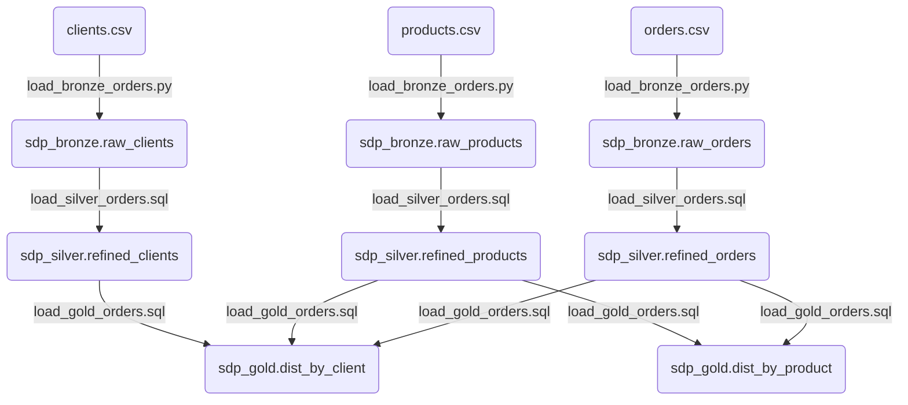

Vous trouverez dans cet article, des informations sur la fonctionnalité [Spark Declarative Pipelines (SDP)](https://spark.apache.org/docs/latest/declarative-pipelines-programming-guide.html) de [Spark v4.1](https://spark.apache.org/releases/spark-release-4.1.0.html).

<!--more-->

# Introduction 


En Juin 2022, [Databricks](https://www.databricks.com/) a annoncé la disponibilité générale d'une nouvelle fonctionnalité nommée [Delta Live Tables (DLT)](https://www.databricks.com/blog/2022/04/05/announcing-generally-availability-of-databricks-delta-live-tables-dlt.html) dans son écosystème et permettant le développement de manière déclarative des pipelines de traitements Spark. 
Cette fonctionnalité se basait principalement sur le format de données [Delta Lake](https://docs.databricks.com/aws/en/delta/) et sur le catalogue de données [Unity Catalog](https://www.databricks.com/product/unity-catalog).

En juin 2025, Lors de l’événement [Data+AI Summit 2025](https://www.databricks.com/dataaisummit), [Databricks](https://www.databricks.com/) a annoncé publiquement [l'ouverture en open source d'une partie cœur de son framework déclaratif de traitement de données basé sur Apache Spark](https://www.databricks.com/company/newsroom/press-releases/databricks-donates-declarative-pipelines-apache-sparktm-open-source) en excluant, par conséquent, un grand nombre de fonctionnalités et d'optimisations qui seront disponibles uniquement sur la plateforme Databricks.

En Juillet 2025, [Databricks](https://www.databricks.com/) a annoncé le renommage de la fonctionnalité Delta Live Tables en [Lakeflow Declarative Pipelines](https://www.databricks.com/blog/whats-new-lakeflow-declarative-pipelines-july-2025) qui est devenu le nom officiel de cette fonctionnalité au sein de la plateforme Databricks.


# Information

Le framework [Spark Declarative Pipelines (SDP)](https://spark.apache.org/docs/latest/declarative-pipelines-programming-guide.html) est un nouveau composant d'Apache Spark 4.1 conçu pour que les développeurs se concentrent sur les transformations de données plutôt que sur la gestion explicite des dépendances et de l'exécution des pipelines. 

En pratique, le framework SDP permet de décrire ce que les données doivent être, et Spark se charge du comment : ordonnancement des tâches, parallélisme, checkpoints, tentatives.
L'API s'appuie sur des décorateurs Python et du SQL, avec un client dédié (`spark-pipelines`) pour exécuter les pipelines.

Le framework SDP gère l'ordre d'exécution, la résolution des dépendances et le traitement incrémental, ce qui facilite le développement, la maintenance, les tests et la surveillance des pipelines.

Le framework SDP est à l'image d'un outil tel que [DBT](https://www.getdbt.com/) ou [SQLMesh](https://sqlmesh.readthedocs.io/en/stable/) mais il est encore immature et avec un écosystème (fonctionnalités, documentations, optimisations, possibilités, compatibilités, ...) très limité.

[Le guide de programmation officiel](https://spark.apache.org/docs/4.1.1/declarative-pipelines-programming-guide.html#querying-tables-defined-in-your-pipeline) est extrêmement claire et concis pour comprendre les concepts importants.

Les éléments clés :
- Le fichier YAML de définition d'un pipeline permet de définir les éléments structurants pour le parsing et l'exécution des flows.
- Il est possible d'utiliser des scripts python (avec des décorateurs) et des scripts SQL.
- Les trois types d'objets (`datasets`) utilisables :
    - **Streaming Table** : Permet de créer une table pour stocker les données traitées avec Spark Streaming
        - Syntaxe Python : `@dp.table` ou `dp.create_streaming_table`
        - Syntaxe SQL : `CREATE STREAMING TABLE`
    - **Materialized View** : Permet de créer une table pour stocker les données en batch
        - Syntaxe Python : `@dp.materialized_view`
        - Syntaxe SQL : `CREATE MATERIALIZED VIEW`
    - **Temporary View** : Permet de créer une vue temporaire pour les résultats intermédiaires lors de l'exécution du pipeline
        - Syntaxe Python : `@dp.temporary_view`
        - Syntaxe SQL : `CREATE TEMPORARY VIEW`


Les commandes spécifiques au framework SDP :
- `spark-pipelines init` : Pour initialiser un premier projet
- `spark-pipelines dry-run --spec pipeline_def.yaml` : Pour valider un pipeline sans l'exécuter (très utile pour valider les pipelines développés lors de l'exécution d'une pipeline CI/CD)
- `spark-pipelines run --spec pipeline_def.yaml` : Pour exécuter le pipeline souhaité


Le fonctionnement générale du framework SDP :
1. Début de l'exécution.
2. Lecture du fichier de définition du pipeline.
3. Création d'une session Spark en s'appuyant sur les éléments de configuration définis dans le fichier de définition du pipeline.
4. Parsing de l'ensemble des fichiers Python ou SQL listés dans le fichier de définition du pipeline.
5. Génération du graphe de flux de données (`dataflow graph`) qui permet au moteur de planifier l'ordre d'exécution des différents éléments constituant le pipeline en fonction des dépendances déclarées.
6. Exécution des différents flux dans l'ordre défini (parallélisation et séquencement en fonction des dépendances).
7. Fin de l'exécution.


Documentation :
- [Décorateur PySpark](https://spark.apache.org/docs/4.1.1/declarative-pipelines-programming-guide.html#programming-with-sdp-in-python) : [API Python](https://spark.apache.org/docs/latest/api/python/reference/pyspark.pipelines.html)
- [Syntaxe SQL](https://spark.apache.org/docs/4.1.1/declarative-pipelines-programming-guide.html#programming-with-sdp-in-sql)  

> **Attention** : 
> Lors des tests, le framework avait beaucoup de mal à définir le graphe de dépendance lorsque le code était entièrement fait avec les décorateur Python. De très nombreuses erreurs était liés au fait que le framework chercher l'existant d'une table dans le catalogue de données plutôt que dans les scripts du pipeline. L'utilisation du code SQL semble beaucoup mieux gérer pour le moment.

# Avantages

1. **Résolution automatique des dépendances et optimisation de l'exécution du pipeline** : C'est le bénéfice le plus concret. L'ordre de définition des fonctions Python ou des requêtes SQL n'a pas d'importance. Le framework SDP analyse le graphe et détermine l'ordre d'exécution optimal. Le framework SDP va exécuter en parallèle les requêtes qui n'ont pas de dépendance directe puis exécuter séquentiellement celles avec des dépendances.
2. **Permet la validation pré-exécution avec dry-run** : Le `dry-run` détecte les erreurs de syntaxe (Python ou SQL), les erreurs d'analyse (table ou colonne inexistante) et les erreurs de validation du graphe comme les dépendances cycliques sans lire ni écrire aucune donnée. Cela permet d'ajouter un contrôle automatique au niveau des pipelines CI/CD.
3. **Format-agnostique** : Le framework SDP supporte toutes les sources de données et tous les catalogues supportés par Spark. Il est recommandé d'utiliser les formats de données [Iceberg](https://iceberg.apache.org/) ou [Delta Lake](https://docs.databricks.com/aws/en/delta/).
4. **Facilite la maintenance** : Il est beaucoup plus facile de comprendre et maintenir un pipeline se basant sur un framework déclaratif qu'un ensemble de traitements PySpark impératifs


# Limitations

1. **Immaturité de l'écosystème (fonctionnalités et outillages)** : Le framework SDP est dans un cycle de développement très actif. Le comportement de certaines fonctionnalités peut changer entre les versions de Spark. Tout n'est pas encore documenté. Il est bien trop tôt pour l'adopter en production. Les orchestrateurs populaires ([Apache Airflow](https://airflow.apache.org/), [Prefect](https://www.prefect.io/), [Dagster](https://dagster.io/)) ne gèrent pas forcément ce framework (ou de façon très limitée).
2. **Les features premium restent chez Databricks** : Les fonctionnalités non disponibles dans le framework SDP incluent par exemple les fonctionnalités suivantes :
    1. L'`Auto CDC` (Change Data Capture)
    2. Les `Expectations` avec `enforcement` automatique (`@dp.expect`, mise en quarantaine automatisée des lignes invalides) 
    3. Data lineage visuel et observabilité avancée intégrée
    4. Journal d'événements (event log) requêtable pour l'audit de pipeline
3. **Débogage moins intuitif qu'avec du code impératif** : Les stack traces référencent des classes internes du framework SDP et non pas directement les lignes du code Python ou SQL. Ce point est particulièrement critique pour les équipes habituées à déboguer des jobs Spark avec des instructions de type `spark.read` ou `df.show()`.
4. **Limitation des fonctions et des optimisations** : Beaucoup moins de possibilités pour gérer des pipelines et des traitements complexes. Cela peut nécessiter de repasser par du code impératif (exemple : gestion des états pour le streaming, besoin des fonctions non supportés comme la fonction `pivot`, ...).


# Codes

## Démarche


Pour tester le framework SDP, nous allons passer par les étapes suivantes :
1. Création d'un cluster Spark v4.1.1 en local
2. Création d'un jeu de données limité
3. Création d'un pipeline dans un projet avec le framework SDP
4. Exécution du pipeline créé


Les répertoires utilisés pour ce projet sont :
- `application` : Répertoire pour stocker l'ensemble des scripts 
- `data` : Répertoire pour stocker les jeux de données (en entrée et en sortie)
- `logs` : Répertoire pour stocker les logs d'exécutions du cluster Spark
- `spark-image-docker` : Répertoire pour stocker les fichiers nécessaires à la création de l'image Docker


## Cluster Spark

Pour pouvoir tester le framework SDP avec la version 4.1.1 de Spark, nous allons créer une image Docker et les éléments nécessaires pour avoir un cluster local composé d'un nœud `Master` (driver) et de deux nœuds `Workers`.


### Création d'une image Docker

Étapes à réaliser à partir du répertoire **spark-image-docker** :
1. Création du fichier `spark-defaults.conf` permettant de définir les éléments de configuration pour le cluster Spark.
2. Création du fichier `spark-env.sh` permettant de définir les variables d'environnement pour le cluster Spark.
3. Création du fichier `spark-start.sh` permettant de définir le script d'exécution des services du cluster Spark.
4. Création du fichier `Dockerfile` permettant de définir le contenu de l'image Spark pour la création du cluster Spark.
5. Exécution de la commande de création de l'image Docker : `docker build -t spark4 spark-image-docker --no-cache`.


Contenu du fichier **spark-defaults.conf** :
```bash
# --- Force JARs into Classpath ---
spark.driver.extraClassPath      /opt/spark/jars/*
spark.executor.extraClassPath    /opt/spark/jars/*

# --- History Server Configuration ---
spark.eventLog.enabled              true
spark.eventLog.dir                  file:///opt/spark/event_logs
spark.history.fs.logDirectory       file:///opt/spark/event_logs

# --- Delta Configuration ---
spark.connect.extensions.relation.classes   org.apache.spark.sql.connect.delta.DeltaRelationPlugin
spark.connect.extensions.command.classes    org.apache.spark.sql.connect.delta.DeltaCommandPlugin
spark.sql.extensions                        io.delta.sql.DeltaSparkSessionExtension

# --- Database Configurations ---
spark.sql.catalog.spark_catalog             org.apache.spark.sql.delta.catalog.DeltaCatalog


# --- Default Catalog configuration ---
spark.sql.defaultCatalog                spark_catalog

# --- Default warehouse local path configuration ---
spark.sql.warehouse.dir              file:///opt/spark/data/warehouse
```

Contenu du fichier **spark-env.sh** :
```bash
#!/bin/env bash

export SPARK_LOCAL_IP=`hostname -i`
export SPARK_PUBLIC_DNS=`hostname -f`
```


Contenu du fichier **spark-start.sh** :
```bash
#!/bin/bash

# Start the SSH daemon
/usr/sbin/sshd
if [ $? -ne 0 ]; then
    echo "Failed to start SSH server. Exiting."
    exit 1
fi

if [ "$SPARK_MODE" = "master" ]; then
    echo "Starting Spark Master..."
    # Spark Master/Driver
    $SPARK_HOME/sbin/start-master.sh 
    # Spark Connect
    $SPARK_HOME/sbin/start-connect-server.sh 
    # History server
    $SPARK_HOME/sbin/start-history-server.sh 
elif [ "$SPARK_MODE" = "worker" ]; then
    echo "Starting Spark Worker..."
    # Spark Worker
    $SPARK_HOME/sbin/start-worker.sh $SPARK_MASTER_URL
else
    echo "Unknown SPARK_MODE: $SPARK_MODE"
    exit 1
fi

# Keep the container alive
tail -f $SPARK_HOME/logs/*
```


Contenu du fichier **Dockerfile** :
```docker
# Use OpenJDK base image
FROM eclipse-temurin:21-jdk-jammy


# Define env variables
ENV SPARK_MASTER="spark://spark-master:7077"
ENV SPARK_MASTER_HOST=spark-master
ENV SPARK_MASTER_PORT=7077
ENV PYSPARK_PYTHON=python3
ENV SPARK_HOME=/opt/spark
ENV PATH=$PATH:$SPARK_HOME/bin:$SPARK_HOME/sbin
ENV DELTA_VERSION="4.1.0"
ENV SPARK_VERSION="4.1.1"
ENV SCALA_VERSION="2.13"


# Install tools
RUN apt-get update \
    && apt-get install -y --no-install-recommends wget tar iputils-ping rsync openssh-server openssh-client \
    && apt-get install -y --no-install-recommends python3 python3-pip \
    && rm -rf /var/lib/apt/lists/*

# Manage SSH informations
RUN mkdir -p /root/.ssh/ \
    && ssh-keygen -t rsa -f /root/.ssh/id_rsa -q -N "" \
    && cat /root/.ssh/id_rsa.pub >> /root/.ssh/authorized_keys \
    && chmod 600 /root/.ssh/authorized_keys \
    && echo "Host *" >> /root/.ssh/config \
    && echo "    StrictHostKeyChecking no" >> /root/.ssh/config \
    && chmod 600 /root/.ssh/config \
    && mkdir -p /var/run/sshd \
    && ssh-keygen -A

# Install Spark
RUN wget https://archive.apache.org/dist/spark/spark-${SPARK_VERSION}/spark-${SPARK_VERSION}-bin-hadoop3.tgz
RUN tar -xzf spark-${SPARK_VERSION}-bin-hadoop3.tgz \
    && rm spark-${SPARK_VERSION}-bin-hadoop3.tgz \
    && mv spark-${SPARK_VERSION}-bin-hadoop3 ${SPARK_HOME} \ 
    && chown -R root:root ${SPARK_HOME} \
    && mkdir -p ${SPARK_HOME}/logs \
    && mkdir -p ${SPARK_HOME}/event_logs

# Download the Delta Spark JAR directly into Spark's main jars directory
# Spark automatically loads all JARs from this folder on startup.
RUN wget https://repo1.maven.org/maven2/io/delta/delta-spark_${SCALA_VERSION}/${DELTA_VERSION}/delta-spark_${SCALA_VERSION}-${DELTA_VERSION}.jar -P ${SPARK_HOME}/jars/
RUN wget https://repo1.maven.org/maven2/io/delta/delta-storage/${DELTA_VERSION}/delta-storage-${DELTA_VERSION}.jar -P ${SPARK_HOME}/jars/
RUN wget https://repo1.maven.org/maven2/io/delta/delta-connect-client_${SCALA_VERSION}/${DELTA_VERSION}/delta-connect-client_${SCALA_VERSION}-${DELTA_VERSION}.jar -P ${SPARK_HOME}/jars/

# Set up Spark configuration for logging and history server
COPY spark-defaults.conf $SPARK_HOME/conf/spark-defaults.conf

# Set up Spark configuration scripts
COPY spark-env.sh $SPARK_HOME/conf/spark-env.sh
COPY spark-start.sh $SPARK_HOME/spark-start.sh
RUN chmod +x $SPARK_HOME/conf/spark-env.sh
RUN chmod +x $SPARK_HOME/spark-start.sh

# Expose needed ports
EXPOSE 7077 8080 4040 15002 22

# Entrypoint config
CMD ["/opt/spark/spark-start.sh"]

```


### Création du fichier Docker Compose

Étapes à réaliser à partir du répertoire racine :
1. Création du fichier `compose.yml` permettant de définir les différents éléments du cluster qui sera composé d'un nœud `Master` et de deux nœuds `Workers`
2. Démarrer le cluster local avec la commande `docker-compose up -d`
3. Arrêter le cluster local avec la commande `docker-compose down`

Contenu du fichier **compose.yml** :
```yaml
services:

  spark-master:
    image: spark4
    container_name: spark-master
    hostname: spark-master
    environment:
      - SPARK_MODE=master
      - SPARK_RPC_AUTHENTICATION_ENABLED=false
      - SPARK_RPC_ENCRYPTION_ENABLED=false
      - SPARK_LOCAL_STORAGE_ENCRYPTION_ENABLED=false
      - SPARK_SSL_ENABLED=false
      - SPARK_PUBLIC_DNS=spark-master
      - SPARK_MASTER_HOST=spark-master
      - SPARK_MASTER_PORT=7077
      - SPARK_DRIVER_MEMORY=1g
      - SPARK_DRIVER_CORES=1
      - SPARK_EXECUTOR_MEMORY=1g
      - SPARK_MASTER_WEBUI_PORT=8080
    ports:
      - "4040:4040"   # Application UI (Job Details)
      - "8080:8080"   # Interface web du master
      - "7077:7077"   # Port de communication Spark
      - "15002:15002" # Port Spark Connect
      - "18080:18080" # Interface History Server
    deploy:
      resources:
        limits:
          cpus: '1'
          memory: 1G
    volumes:
      - ./data:/opt/spark/data
      - ./logs/events:/opt/spark/event_logs
      - ./application/src:/home/root/src
    networks:
      - spark-network


  spark-worker-1:
    image: spark4
    container_name: spark-worker-1
    hostname: spark-worker-1
    depends_on:
      - spark-master
    environment:
      - SPARK_MODE=worker
      - SPARK_MASTER_URL=spark://spark-master:7077
      - SPARK_RPC_AUTHENTICATE=false
      - SPARK_RPC_ENCRYPTION=false
      - SPARK_LOCAL_STORAGE_ENCRYPTION=false
      - SPARK_SSL_ENABLED=no
      - SPARK_PUBLIC_DNS=spark-worker-1
      - SPARK_MASTER_HOST=spark-master
      - SPARK_MASTER_PORT=7077
      - SPARK_WORKER_CORES=2
      - SPARK_WORKER_MEMORY=2g
      - SPARK_EXECUTOR_MEMORY=1g
      - SPARK_WORKER_WEBUI_PORT=8081
    ports:
      - "8081:8081" # Interface web (worker)
    volumes:
      - ./data:/opt/spark/data
    networks:
      - spark-network
    deploy:
      resources:
        limits:
          cpus: '2'
          memory: 2G


  spark-worker-2:
    image: spark4
    container_name: spark-worker-2
    hostname: spark-worker-2
    depends_on:
      - spark-master
    environment:
      - SPARK_MODE=worker
      - SPARK_MASTER_URL=spark://spark-master:7077
      - SPARK_RPC_AUTHENTICATE=false
      - SPARK_RPC_ENCRYPTION=false
      - SPARK_LOCAL_STORAGE_ENCRYPTION=false
      - SPARK_SSL_ENABLED=no
      - SPARK_PUBLIC_DNS=spark-worker-2
      - SPARK_MASTER_HOST=spark-master
      - SPARK_MASTER_PORT=7077
      - SPARK_WORKER_CORES=2
      - SPARK_WORKER_MEMORY=2g
      - SPARK_EXECUTOR_MEMORY=1g
      - SPARK_WORKER_WEBUI_PORT=8081
    ports:
      - "8082:8081" # Interface web (worker)
    volumes:
      - ./data:/opt/spark/data
    networks:
      - spark-network
    deploy:
      resources:
        limits:
          cpus: '2'
          memory: 2G


networks:
  spark-network:
    driver: bridge

```


Contenu du fichier de log après exécution de la commande `docker-compose up -d` : 
```bash
[+] up 4/4
 ✔ Network spark4_spark-network Created
 ✔ Container spark-master       Created
 ✔ Container spark-worker-1     Created
 ✔ Container spark-worker-2     Created
```


Contenu du fichier de log après exécution de la commande `docker-compose down` : 
```bash
[+] down 4/4
 ✔ Container spark-worker-2     Removed
 ✔ Container spark-worker-1     Removed
 ✔ Container spark-master       Removed
 ✔ Network spark4_spark-network Removed
```

### Liste des ports et des interfaces

En se basant sur la configuration définie dans le fichier **compose.yml** :
- `4040` : Port de communication avec [l'interface applicative (UI) des jobs](http://localhost:4040/jobs/)
- `7077` : Port de communication interne du cluster Spark
- `8080` : Port de communication avec [l'interface web du Master (driver)](http://localhost:8080/)
- `8081` : Port de communication avec [l'interface web du Worker n°1](http://localhost:8081/)
- `8082` : Port de communication avec [l'interface web du Worker n°2](http://localhost:8082/)
- `15002` : Port de communication avec le serveur Spark Connect
- `18080`: Port de communication avec [l'interface History Server](http://localhost:18080/)

## Jeu de données

Dans le répertoire **data** :
1. Création d'un répertoire `input` : `mkdir -p data/input`
2. Création du fichier `clients.csv` pour stocker quelques lignes définissants des clients
3. Création du fichier `products.csv` pour stocker quelques lignes définissant les produits
4. Création du fichier `orders.csv` pour stocker quelques lignes définissant des événements d'achats des produits par les clients


Contenu du fichier **clients.csv** :
```text
id_client,lib_client,lib_city
1,Alice,Paris
2,Bob,Lyon
3,Charlie,Marseille
4,David,Lille
5,Eve,Bordeaux
```

Contenu du fichier **products.csv** :
```text
id_product,lib_product,mnt_prix_unit,lib_category
101,Laptop,1200.0,Electronique
102,Souris,25.0,Accessoires
103,Clavier,45.0,Accessoires
104,Ecran,200.0,Electronique
105,Casque,80.0,Audio
```

Contenu du fichier **orders.csv** :
```text
id_commande,id_client,id_product,nb_quantity,dt_commande
1,1,101,1,2025-10-01
2,2,102,2,2025-10-01
3,3,103,1,2025-10-02
4,1,104,1,2025-10-02
5,5,105,2,2025-10-03
6,2,101,1,2025-10-03
7,4,103,3,2025-10-04
8,1,102,1,2025-10-04
9,3,101,1,2025-10-05
10,5,104,1,2025-10-05
11,2,105,1,2025-10-06
12,4,101,1,2025-10-06
13,1,105,1,2025-10-07
14,3,102,4,2025-10-07
15,5,103,1,2025-10-08
```


## Création d'un pipeline dans un projet SDP

Les étapes sont les suivantes :
1. Installation du framework SDP en local
2. Initialisation d'un projet SDP template en utilisant la commande `spark-pipelines init`
3. Création des éléments nécessaires au pipeline

### Installation du framework SDP en local

L'installation des éléments nécessaires pour pouvoir tester le framework SDP se fait avec la commande `pip` suivante : `pip install pyspark[pipelines]`.

Suite à certain problème de compatibilité des dépendances sur mon environnement de travail, j'ai utilisé la commande suivante pour installer les éléments nécessaires avec les versions compatibles correspondantes : `pip install pyspark==4.1.1 pyspark[pipelines] protobuf==6.33.0`

### Initialisation d'un projet SDP

Afin de pouvoir initialiser un projet SDP, le plus simple est de se positionner dans le répertoire `application` et d'exécuter la commande suivante `spark-pipelines init --name LoadOrdersData`.

Cela aura pour effet de créer un répertoire nommé `LoadOrdersData` dans le répertoire `application` ainsi que l'arborescence suivante :
- `pipeline-storage/` : Répertoire permettant de stocker les checkpoints lors de l'utilisation de Spark Streaming
- `transformations/` : Répertoire permettant de stocker l'ensemble des scripts Python et SQL définissant les pipelines
- `spark-pipeline.yml` : Fichier de configuration du pipeline

### Création des éléments nécessaire au pipeline

L'objectif est de créer le pipeline suivante :


Schema : 
[](/blog/web/20260427_spark_4_06_featture_SDP_01.png) 

Les étapes sont les suivantes :
- Création du script python `load_bronze_orders.py` permettant de définir les tables pour stocker les données des fichiers CSV
- Création du script SQL `load_silver_orders.sql` permettant de raffiner les tables de la zone bronze dans la zone silver
- Création du script SQL `load_gold_orders.sql` permettant d'exécuter des requêtes d'agrégations à partir des tables de la zone silver


Contenu du fichier **load_bronze_orders.py** :
```python
from pyspark import pipelines as dp
from pyspark.sql import DataFrame, SparkSession
from pyspark.sql.functions import current_timestamp


PATH_DATA_INPUT="file:///opt/spark/data/input"
spark = SparkSession.active()


# --- Bronze zone (raw loading) ---
@dp.materialized_view(name="sdp_bronze.raw_orders")
def raw_orders() -> DataFrame:
    return spark.read \
                .format("csv") \
                .option("header",True) \
                .option("inferSchema",True) \
                .load(f"{PATH_DATA_INPUT}/orders.csv") \
                .withColumn("ts_load_file", current_timestamp())

@dp.materialized_view(name="sdp_bronze.raw_clients")
def raw_clients() -> DataFrame:
    return spark.read \
                .format("csv") \
                .option("header",True) \
                .option("inferSchema",True) \
                .load(f"{PATH_DATA_INPUT}/clients.csv") \
                .withColumn("ts_load_file", current_timestamp())

@dp.materialized_view(name="sdp_bronze.raw_products")
def raw_products() -> DataFrame:
    return spark.read \
                .format("csv") \
                .option("header",True) \
                .option("inferSchema",True) \
                .load(f"{PATH_DATA_INPUT}/products.csv") \
                .withColumn("ts_load_file", current_timestamp())
```


Contenu du fichier **load_silver_orders.sql** :
```sql
--- Silver Zone (cleaned & typed) ---
CREATE MATERIALIZED VIEW sdp_silver.refined_orders
AS
SELECT int(id_commande) 
    ,int(id_client) 
    ,int(id_product)
    ,int(nb_quantity)
    ,to_date(dt_commande) as dt_commande
    ,to_timestamp(ts_load_file) as ts_load_file
FROM sdp_bronze.raw_orders 
WHERE id_commande IS NOT NULL
;


CREATE MATERIALIZED VIEW sdp_silver.refined_clients
AS
SELECT int(id_client)
    ,string(lib_client) 
    ,string(lib_city)
    ,to_timestamp(ts_load_file) as ts_load_file
FROM sdp_bronze.raw_clients 
WHERE id_client IS NOT NULL
;


CREATE MATERIALIZED VIEW sdp_silver.refined_products
AS
SELECT int(id_product)
    ,string(lib_product)
    ,double(mnt_prix_unit)
    ,string(lib_category)
    ,to_timestamp(ts_load_file) as ts_load_file
FROM sdp_bronze.raw_products 
WHERE id_product IS NOT NULL
;
```

Contenu du fichier **load_gold_orders.sql** :
```sql
--- Gold Zone (Business analyses) ---
CREATE MATERIALIZED VIEW sdp_gold.dist_by_client
AS
SELECT c.id_client, c.lib_client, ROUND(SUM(o.nb_quantity * p.mnt_prix_unit), 2) as total_expense
FROM sdp_silver.refined_orders o
INNER JOIN sdp_silver.refined_clients c 
ON (o.id_client = c.id_client)
INNER JOIN sdp_silver.refined_products p 
ON (o.id_product = p.id_product)
GROUP BY c.id_client, c.lib_client
ORDER BY total_expense DESC
;

CREATE MATERIALIZED VIEW sdp_gold.dist_by_product
AS 
SELECT p.id_product, p.lib_product, SUM(o.nb_quantity) as sales_volume
FROM sdp_silver.refined_orders o
INNER JOIN sdp_silver.refined_products p 
ON (o.id_product = p.id_product)
GROUP BY p.id_product, p.lib_product
ORDER BY sales_volume DESC
;
```


### Création des éléments pour gérer l'environnement

Afin de pouvoir gérer proprement l'environnement, nous allons créer deux scripts PySpark dans le répertoire `application/LoadOrdersData` :
- Le script `init_schemas.py` permettant de créer les schémas nécessaires à la création des tables du pipelines
    - `sdp_bronze`: pour le stockage des tables bronze
    - `sdp_silver`: pour le stockage des tables silver
    - `sdp_gold`: pour le stockage des tables gold
- Le script `check_list_tables.py` permettant d'afficher l'ensemble des éléments créés


Contenu du script **init_schemas.py** :
```python
from pyspark.sql import SparkSession
from pyspark.sql.functions import col

REMOTE_URL = "sc://localhost:15002"

spark = SparkSession.builder.remote(REMOTE_URL).getOrCreate()

spark.sql("CREATE SCHEMA IF NOT EXISTS sdp_bronze COMMENT 'Schema for SDP Pipelines - Bronze Zone'")
spark.sql("CREATE SCHEMA IF NOT EXISTS sdp_silver COMMENT 'Schema for SDP Pipelines - Silver Zone'")
spark.sql("CREATE SCHEMA IF NOT EXISTS sdp_gold COMMENT 'Schema for SDP Pipelines - Gold Zone'")

list_schemas = spark.sql("show schemas;").where(col("namespace").like('sdp_%'))

nb_sdp_schema = list_schemas.count()

if (nb_sdp_schema == 3):
    print(f"[INFO] The SDP Schemas have been successfully created !")
else :
    print(f"[WARN] The SDP Schemas were not created successfully !")

list_schemas.show()

spark.stop()
```

Contenu du script **check_list_tables.py** :
```python
from pyspark.sql import SparkSession
from pyspark.sql.functions import col

REMOTE_URL = "sc://localhost:15002"

spark = SparkSession.builder.remote(REMOTE_URL).getOrCreate()

list_tables = ['clients','products','orders']
list_tables_gold = ['dist_by_client','dist_by_product']

print(f"[INFO] Data from SDP_BRONZE :")
for table in list_tables :
    tmp_table = f"sdp_bronze.raw_{table}"
    print(f"- {tmp_table} :")
    spark.table(tmp_table).show(truncate=False)

print(f"[INFO] Data from SDP_SILVER :")
for table in list_tables :
    tmp_table = f"sdp_silver.refined_{table}"
    print(f"- {tmp_table} :")
    spark.table(tmp_table).show(truncate=False)

print(f"[INFO] Data from SDP_GOLD :")
for table in list_tables_gold :
    tmp_table = f"sdp_gold.{table}"
    print(f"- {tmp_table} :")
    spark.table(tmp_table).show(truncate=False)

spark.stop()
```


## Résultat de l'exécution du pipeline créé

### Exécution du pipeline

L'ensemble des commandes seront exécutés à partir du répertoire `application/LoadOrdersData/`

L'ordre d'exécution est le suivant :
1. Exécution du script d'initialisation des schémas avec la commande `python init_schemas.py` 
2. Vérifier que le message affiché par le script `init_schemas.py` est `[INFO] The SDP Schemas have been successfully created !`
3. Exécution du pipeline avec la commande `spark-pipelines run --spec spark-pipeline.yml`
4. Exécution du script de vérification des objets créés avec la commande `python check_list_tables.py`


### Résultat de l'exécution

Résultat de l'exécution de la commande `python init_schemas.py` :
```bash
[INFO] The SDP Schemas have been successfully created !
+----------+
| namespace|
+----------+
|sdp_bronze|
|  sdp_gold|
|sdp_silver|
+----------+
```


Résultat de l'exécution de la commande `spark-pipelines run --spec spark-pipeline.yml` :
```bash
2026-03-30 19:31:25: Loading pipeline spec from spark-pipeline.yml...
2026-03-30 19:31:25: Creating Spark session...
2026-03-30 19:31:25: Creating dataflow graph...
2026-03-30 19:31:25: Registering graph elements...
2026-03-30 19:31:25: Loading definitions. Root directory: '.../application/LoadOrdersData'.
2026-03-30 19:31:25: Found 3 files matching glob 'transformations/**/*'
2026-03-30 19:31:25: Importing .../application/LoadOrdersData/transformations/load_bronze_orders.py...
2026-03-30 19:31:27: Registering SQL file .../application/LoadOrdersData/transformations/load_gold_orders.sql...
2026-03-30 19:31:28: Registering SQL file .../application/LoadOrdersData/transformations/load_silver_orders.sql...
2026-03-30 19:31:28: Starting run...
2026-03-30 19:31:38: Flow spark_catalog.sdp_gold.dist_by_product is QUEUED.
2026-03-30 19:31:38: Flow spark_catalog.sdp_silver.refined_orders is QUEUED.
2026-03-30 19:31:38: Flow spark_catalog.sdp_bronze.raw_orders is QUEUED.
2026-03-30 19:31:38: Flow spark_catalog.sdp_silver.refined_products is QUEUED.
2026-03-30 19:31:38: Flow spark_catalog.sdp_bronze.raw_clients is QUEUED.
2026-03-30 19:31:38: Flow spark_catalog.sdp_bronze.raw_products is QUEUED.
2026-03-30 19:31:38: Flow spark_catalog.sdp_gold.dist_by_client is QUEUED.
2026-03-30 19:31:38: Flow spark_catalog.sdp_silver.refined_clients is QUEUED.
2026-03-30 19:31:38: Flow spark_catalog.sdp_bronze.raw_clients is PLANNING.
2026-03-30 19:31:38: Flow spark_catalog.sdp_bronze.raw_clients is STARTING.
2026-03-30 19:31:38: Flow spark_catalog.sdp_bronze.raw_clients is RUNNING.
2026-03-30 19:31:38: Flow spark_catalog.sdp_bronze.raw_orders is PLANNING.
2026-03-30 19:31:38: Flow spark_catalog.sdp_bronze.raw_orders is STARTING.
2026-03-30 19:31:38: Flow spark_catalog.sdp_bronze.raw_orders is RUNNING.
2026-03-30 19:31:38: Flow spark_catalog.sdp_bronze.raw_products is PLANNING.
2026-03-30 19:31:38: Flow spark_catalog.sdp_bronze.raw_products is STARTING.
2026-03-30 19:31:38: Flow spark_catalog.sdp_bronze.raw_products is RUNNING.
2026-03-30 19:31:41: Flow spark_catalog.sdp_bronze.raw_orders has COMPLETED.
2026-03-30 19:31:41: Flow spark_catalog.sdp_bronze.raw_products has COMPLETED.
2026-03-30 19:31:41: Flow spark_catalog.sdp_bronze.raw_clients has COMPLETED.
2026-03-30 19:31:42: Flow spark_catalog.sdp_silver.refined_orders is PLANNING.
2026-03-30 19:31:42: Flow spark_catalog.sdp_silver.refined_orders is STARTING.
2026-03-30 19:31:42: Flow spark_catalog.sdp_silver.refined_orders is RUNNING.
2026-03-30 19:31:42: Flow spark_catalog.sdp_silver.refined_clients is PLANNING.
2026-03-30 19:31:42: Flow spark_catalog.sdp_silver.refined_clients is STARTING.
2026-03-30 19:31:42: Flow spark_catalog.sdp_silver.refined_clients is RUNNING.
2026-03-30 19:31:42: Flow spark_catalog.sdp_silver.refined_products is PLANNING.
2026-03-30 19:31:42: Flow spark_catalog.sdp_silver.refined_products is STARTING.
2026-03-30 19:31:42: Flow spark_catalog.sdp_silver.refined_products is RUNNING.
2026-03-30 19:31:58: Flow spark_catalog.sdp_silver.refined_clients has COMPLETED.
2026-03-30 19:31:58: Flow spark_catalog.sdp_silver.refined_products has COMPLETED.
2026-03-30 19:31:58: Flow spark_catalog.sdp_silver.refined_orders has COMPLETED.
2026-03-30 19:31:59: Flow spark_catalog.sdp_gold.dist_by_product is PLANNING.
2026-03-30 19:31:59: Flow spark_catalog.sdp_gold.dist_by_product is STARTING.
2026-03-30 19:31:59: Flow spark_catalog.sdp_gold.dist_by_product is RUNNING.
2026-03-30 19:31:59: Flow spark_catalog.sdp_gold.dist_by_client is PLANNING.
2026-03-30 19:31:59: Flow spark_catalog.sdp_gold.dist_by_client is STARTING.
2026-03-30 19:31:59: Flow spark_catalog.sdp_gold.dist_by_client is RUNNING.
2026-03-30 19:32:16: Flow spark_catalog.sdp_gold.dist_by_product has COMPLETED.
2026-03-30 19:32:16: Flow spark_catalog.sdp_gold.dist_by_client has COMPLETED.
2026-03-30 19:32:17: Run is COMPLETED.
```


Résultat de l'exécution de la commande `python check_list_tables.py` :
```bash
[INFO] Data from SDP_BRONZE :
- sdp_bronze.raw_clients :
+---------+----------+---------+--------------------------+
|id_client|lib_client|lib_city |ts_load_file              |
+---------+----------+---------+--------------------------+
|1        |Alice     |Paris    |2026-03-30 19:31:38.862824|
|2        |Bob       |Lyon     |2026-03-30 19:31:38.862824|
|3        |Charlie   |Marseille|2026-03-30 19:31:38.862824|
|4        |David     |Lille    |2026-03-30 19:31:38.862824|
|5        |Eve       |Bordeaux |2026-03-30 19:31:38.862824|
+---------+----------+---------+--------------------------+

- sdp_bronze.raw_products :
+----------+-----------+-------------+------------+--------------------------+
|id_product|lib_product|mnt_prix_unit|lib_category|ts_load_file              |
+----------+-----------+-------------+------------+--------------------------+
|101       |Laptop     |1200.0       |Electronique|2026-03-30 19:31:38.859625|
|102       |Souris     |25.0         |Accessoires |2026-03-30 19:31:38.859625|
|103       |Clavier    |45.0         |Accessoires |2026-03-30 19:31:38.859625|
|104       |Ecran      |200.0        |Electronique|2026-03-30 19:31:38.859625|
|105       |Casque     |80.0         |Audio       |2026-03-30 19:31:38.859625|
+----------+-----------+-------------+------------+--------------------------+

- sdp_bronze.raw_orders :
+-----------+---------+----------+-----------+-----------+--------------------------+
|id_commande|id_client|id_product|nb_quantity|dt_commande|ts_load_file              |
+-----------+---------+----------+-----------+-----------+--------------------------+
|1          |1        |101       |1          |2025-10-01 |2026-03-30 19:31:38.762104|
|2          |2        |102       |2          |2025-10-01 |2026-03-30 19:31:38.762104|
|3          |3        |103       |1          |2025-10-02 |2026-03-30 19:31:38.762104|
|4          |1        |104       |1          |2025-10-02 |2026-03-30 19:31:38.762104|
|5          |5        |105       |2          |2025-10-03 |2026-03-30 19:31:38.762104|
|6          |2        |101       |1          |2025-10-03 |2026-03-30 19:31:38.762104|
|7          |4        |103       |3          |2025-10-04 |2026-03-30 19:31:38.762104|
|8          |1        |102       |1          |2025-10-04 |2026-03-30 19:31:38.762104|
|9          |3        |101       |1          |2025-10-05 |2026-03-30 19:31:38.762104|
|10         |5        |104       |1          |2025-10-05 |2026-03-30 19:31:38.762104|
|11         |2        |105       |1          |2025-10-06 |2026-03-30 19:31:38.762104|
|12         |4        |101       |1          |2025-10-06 |2026-03-30 19:31:38.762104|
|13         |1        |105       |1          |2025-10-07 |2026-03-30 19:31:38.762104|
|14         |3        |102       |4          |2025-10-07 |2026-03-30 19:31:38.762104|
|15         |5        |103       |1          |2025-10-08 |2026-03-30 19:31:38.762104|
+-----------+---------+----------+-----------+-----------+--------------------------+

[INFO] Data from SDP_SILVER :
- sdp_silver.refined_clients :
+---------+----------+---------+--------------------------+
|id_client|lib_client|lib_city |ts_load_file              |
+---------+----------+---------+--------------------------+
|1        |Alice     |Paris    |2026-03-30 19:31:38.862824|
|2        |Bob       |Lyon     |2026-03-30 19:31:38.862824|
|3        |Charlie   |Marseille|2026-03-30 19:31:38.862824|
|4        |David     |Lille    |2026-03-30 19:31:38.862824|
|5        |Eve       |Bordeaux |2026-03-30 19:31:38.862824|
+---------+----------+---------+--------------------------+

- sdp_silver.refined_products :
+----------+-----------+-------------+------------+--------------------------+
|id_product|lib_product|mnt_prix_unit|lib_category|ts_load_file              |
+----------+-----------+-------------+------------+--------------------------+
|101       |Laptop     |1200.0       |Electronique|2026-03-30 19:31:38.859625|
|102       |Souris     |25.0         |Accessoires |2026-03-30 19:31:38.859625|
|103       |Clavier    |45.0         |Accessoires |2026-03-30 19:31:38.859625|
|104       |Ecran      |200.0        |Electronique|2026-03-30 19:31:38.859625|
|105       |Casque     |80.0         |Audio       |2026-03-30 19:31:38.859625|
+----------+-----------+-------------+------------+--------------------------+

- sdp_silver.refined_orders :
+-----------+---------+----------+-----------+-----------+--------------------------+
|id_commande|id_client|id_product|nb_quantity|dt_commande|ts_load_file              |
+-----------+---------+----------+-----------+-----------+--------------------------+
|1          |1        |101       |1          |2025-10-01 |2026-03-30 19:31:38.762104|
|2          |2        |102       |2          |2025-10-01 |2026-03-30 19:31:38.762104|
|3          |3        |103       |1          |2025-10-02 |2026-03-30 19:31:38.762104|
|4          |1        |104       |1          |2025-10-02 |2026-03-30 19:31:38.762104|
|5          |5        |105       |2          |2025-10-03 |2026-03-30 19:31:38.762104|
|6          |2        |101       |1          |2025-10-03 |2026-03-30 19:31:38.762104|
|7          |4        |103       |3          |2025-10-04 |2026-03-30 19:31:38.762104|
|8          |1        |102       |1          |2025-10-04 |2026-03-30 19:31:38.762104|
|9          |3        |101       |1          |2025-10-05 |2026-03-30 19:31:38.762104|
|10         |5        |104       |1          |2025-10-05 |2026-03-30 19:31:38.762104|
|11         |2        |105       |1          |2025-10-06 |2026-03-30 19:31:38.762104|
|12         |4        |101       |1          |2025-10-06 |2026-03-30 19:31:38.762104|
|13         |1        |105       |1          |2025-10-07 |2026-03-30 19:31:38.762104|
|14         |3        |102       |4          |2025-10-07 |2026-03-30 19:31:38.762104|
|15         |5        |103       |1          |2025-10-08 |2026-03-30 19:31:38.762104|
+-----------+---------+----------+-----------+-----------+--------------------------+

[INFO] Data from SDP_GOLD :
- sdp_gold.dist_by_client :
+---------+----------+-------------+
|id_client|lib_client|total_expense|
+---------+----------+-------------+
|1        |Alice     |1505.0       |
|3        |Charlie   |1345.0       |
|4        |David     |1335.0       |
|2        |Bob       |1330.0       |
|5        |Eve       |405.0        |
+---------+----------+-------------+

- sdp_gold.dist_by_product :
+----------+-----------+------------+
|id_product|lib_product|sales_volume|
+----------+-----------+------------+
|102       |Souris     |7           |
|103       |Clavier    |5           |
|105       |Casque     |4           |
|101       |Laptop     |4           |
|104       |Ecran      |2           |
+----------+-----------+------------+
```


